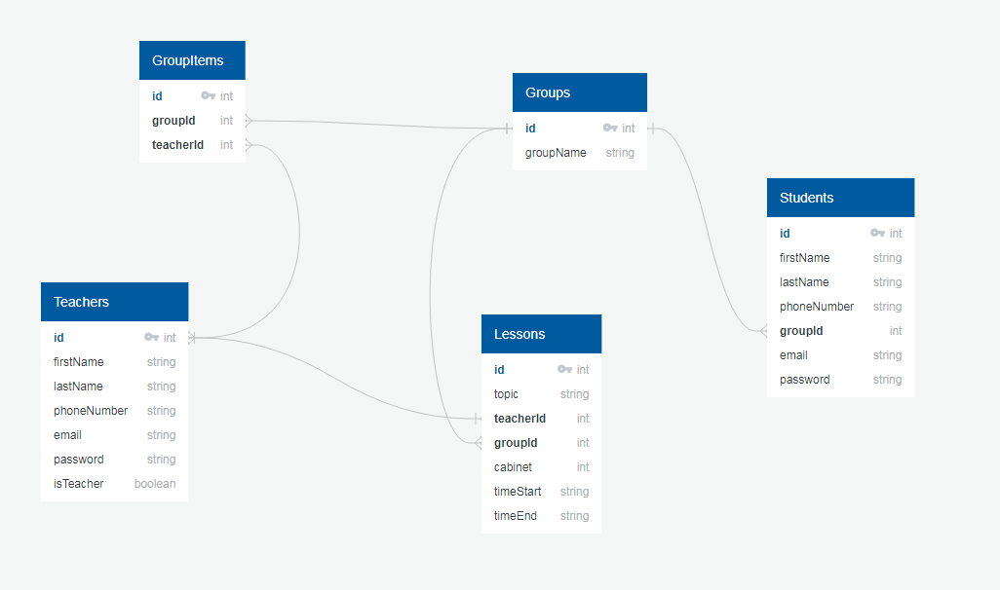

# REST API using express.js for simple School model with CRUD operations

## Installation

To successfully run this project locally, follow the next steps, please.

create .env file in the root directory with the following fields
DB_HOST=your DB_HOST
DB_PORT=your DB_PORT
DB_NAME=your DB_NAME
DB_USER=your DB_USER
DB_PASS=your DB_PASS
DB_DIALECT=your DB_DIALECT
SECRET_KEY=your SECRET_KEY
EXPIRES_IN=your EXPIRES_IN

Run this commands.
1 npm install
2 npm run migrate
3 npm run seed
4 npm start

## How to use

All routes are protected by auth middleware. Only logged in user to the system can use operations: Create, Read, Update, Delete
Teachers have more rights in the system for these operations.

Groups and Lessons entity have CRUD operations

Teachers and Students entity have read operations

Routes list

http://localhost:4000/auth/login POST

http://localhost:4000/students/all GET
http://localhost:4000/students/:id GET

http://localhost:4000/all GET
http://localhost:4000/:id GET

http://localhost:4000/groups/ POST
http://localhost:4000/groups/all GET
http://localhost:4000/groups/:groupName GET
http://localhost:4000/groups/:id PUT
http://localhost:4000/groups/:id DELETE

http://localhost:4000/lessons/ POST
http://localhost:4000/lessons/all GET
http://localhost:4000/lessons/:groupName GET
http://localhost:4000/lessons/:id PUT
http://localhost:4000/lessons/:id DELETE

